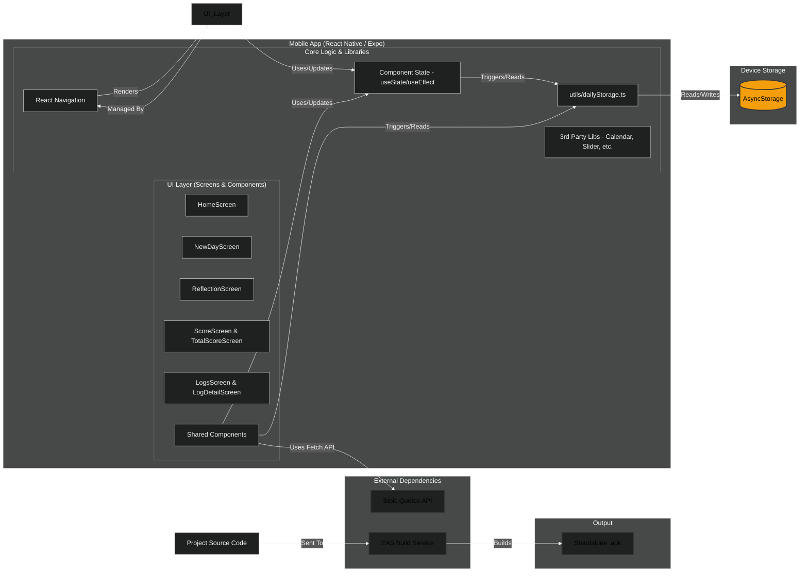

# Stoiric 

This is the mobile client for [Stoiric](https://stoiric.vercel.app), a minimalist daily journaling app that helps you track your goals, reflect on your day, and measure your personal growth.

## Tech Stack

*   React Native
*   Expo SDK
*   TypeScript

## To Build the App Locally

### Prerequisites

*   Node.js (LTS version recommended)
*   npm or yarn
*   Expo Go app on your mobile device (for development) or Android/iOS simulator/emulator
*   EAS CLI: `npm install -g eas-cli`

### Installation

1.  Clone the repository (or download the source code).
2.  Navigate to the project directory: `cd stoiric-mobile`
3.  Install dependencies:
    ```bash
    npm install
    # or
    yarn install
    ```

### Running the App (Development)

1.  Start the Metro bundler and development server:
    ```bash
    npm expo start
    # or
    yarn expo start
    ```
2.  This will open the Expo Dev Tools in your browser.
3.  You can then:
    *   Scan the QR code with the Expo Go app on your Android or iOS device.
    *   Run on an Android emulator/device: `npm run android` or `yarn android`
    *   Run on an iOS simulator/device (macOS only): `npm run ios` or `yarn ios`

## Building for Production (Android APK)

1.  Log in to your Expo account using the EAS CLI:
    ```bash
    eas login
    ```
2.  Start the build process for the production profile (which is configured in `eas.json` to build an APK):
    ```bash
    eas build -p android --profile production
    ```
3.  Follow the prompts from the EAS CLI. Once the build is complete, you can download the `.apk` file from the build details page provided by EAS.

## Architecture

